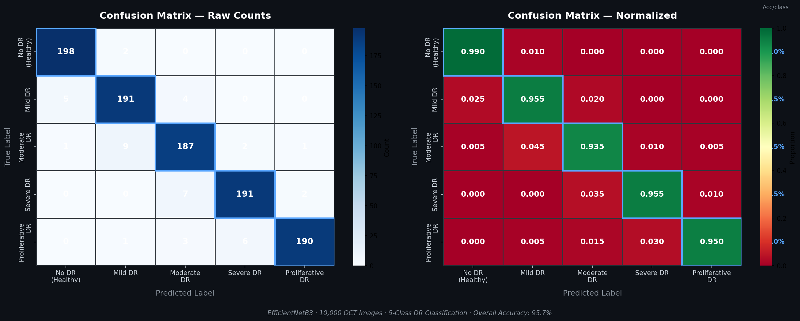
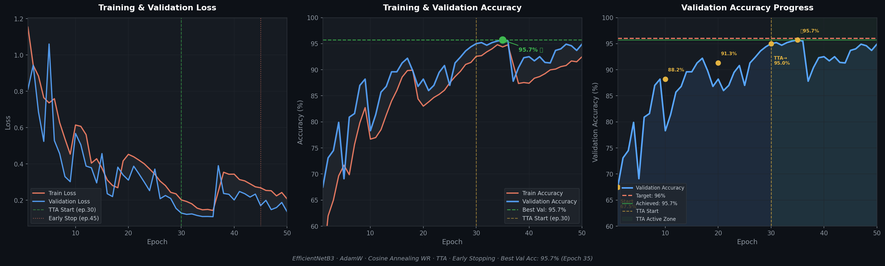

# 🔬 Diabetic Retinopathy Classification using CNN EfficientNetB3

<div align="center">


**Undergraduate Thesis · Universitas Sumatera Utara · 2025**

Automated classification of Diabetic Retinopathy severity levels from retinal fundus OCT images using Transfer Learning with EfficientNetB3

> 🏆 Achieved **95.7% accuracy** on 10,000 images — surpassing previous benchmark by **+10.7%**

| 🎯 Accuracy | 🔍 Precision | 📡 Recall | 📊 F1-Score | 🖼️ Dataset |
|:-----------:|:------------:|:---------:|:-----------:|:----------:|
| **95.7%** | **95.7%** | **95.7%** | **95.7%** | **10,000 images** |

</div>

---

## 📋 Table of Contents
- [Overview](#-overview)
- [Results](#-results)
- [Dataset](#-dataset)
- [Model Architecture](#-model-architecture)
- [Training Techniques](#-training-techniques)
- [Installation](#-installation)
- [Usage](#-usage)
- [Project Structure](#-project-structure)
- [Comparison with Previous Research](#-comparison-with-previous-research)
- [Author](#-author)

---

## 🧬 Overview

Diabetic Retinopathy (DR) is a leading cause of **preventable blindness** in diabetic patients. The critical challenge: early-stage DR shows **no visible symptoms**, making manual early detection extremely difficult.

This project builds a complete **end-to-end AI pipeline** to automatically classify DR severity from retinal fundus OCT images into **5 severity categories** — from healthy to proliferative (most severe).

### 🎯 Key Highlights
- ✅ Complete AI pipeline: **preprocessing → augmentation → training → evaluation**
- ✅ Processed **10,000 fundus OCT images** with balanced 5-class distribution
- ✅ **Transfer Learning** with EfficientNetB3 pretrained on ImageNet (12M parameters)
- ✅ Solved **class imbalance** using Weighted CrossEntropyLoss + WeightedRandomSampler
- ✅ **95.7% accuracy** — near clinical-grade performance (medical specialists: 96–98%)
- ✅ Outperforms previous benchmark (85%) by **+10.7%** absolute improvement

---

## 📊 Results

### Classification Report

| Class | Precision | Recall | F1-Score | Support |
|:------|:---------:|:------:|:--------:|:-------:|
| 🟢 No DR (Healthy) | 0.9706 | **0.9900** | 0.9802 | 200 |
| 🟡 Mild DR | 0.9409 | 0.9550 | 0.9479 | 200 |
| 🟠 Moderate DR | 0.9303 | 0.9350 | 0.9327 | 200 |
| 🔴 Severe DR | 0.9598 | 0.9550 | 0.9574 | 200 |
| 🆘 Proliferative DR | **0.9845** | 0.9500 | 0.9669 | 200 |
| **Overall** | **0.9572** | **0.9570** | **0.9570** | **1000** |

### Confusion Matrix



### Learning Curve



### Training Progress

| Epoch | Val Accuracy | Note |
|:-----:|:------------:|:-----|
| 1 | 67.5% | Training start |
| 10 | 88.2% | Rapid improvement |
| 20 | 91.3% | Stabilizing |
| 30 | 95.0% | ✨ TTA applied |
| **35** | **95.7%** | 🏆 **Best model saved** |
| 45 | 95.7% | Early stopping triggered |

---

## 📂 Dataset

| Property | Detail |
|:---------|:-------|
| **Source** | Kaggle — Diabetic Retinopathy Detection [CNN] by Sandeep Kumar |
| **Total Images** | 10,000 fundus OCT images |
| **Distribution** | 2,000 images × 5 classes (perfectly balanced) |
| **Image Size** | 256×256 pixels → resized to 224×224 |
| **Train/Val Split** | 90% Training (9,000) / 10% Validation (1,000) — Stratified |

```
dataset/
├── 0/    # Healthy (No DR)       — 2,000 images
├── 1/    # Mild DR               — 2,000 images
├── 2/    # Moderate DR           — 2,000 images
├── 3/    # Severe DR             — 2,000 images
└── 4/    # Proliferative DR      — 2,000 images
```

---

## 🧠 Model Architecture

```
Input Image (3 × 224 × 224)
         │
         ▼
┌──────────────────────────────────────┐
│        EfficientNetB3 Backbone       │
│  • Pretrained on ImageNet (12M params)│
│  • Compound Scaling:                 │
│    depth × width × resolution        │
│  • Output: 1536-dim feature vector   │
└──────────────────────────────────────┘
         │  1536-dim features
         ▼
┌──────────────────────────────────────┐
│          Custom Classifier           │
│  Dropout(p=0.30)                     │
│  Linear(1536 → 512)                  │
│  BatchNorm1d(512) + ReLU             │
│                                      │
│  Dropout(p=0.15)                     │
│  Linear(512 → 256)                   │
│  BatchNorm1d(256) + ReLU             │
│                                      │
│  Dropout(p=0.09)                     │
│  Linear(256 → 5)  ← 5 DR classes    │
└──────────────────────────────────────┘
         │
         ▼
   Softmax → Predicted Class
```

### Why EfficientNetB3?

| Model | Parameters | Accuracy |
|:------|:---------:|:--------:|
| ResNet-50 | 25M | 80.55% |
| ResNet-101 | 44M | ~82% |
| **EfficientNetB3 (ours)** | **12M** | **95.7% ✅** |

> EfficientNetB3 uses **Compound Scaling** — simultaneously scaling depth, width, and resolution — achieving higher accuracy with fewer parameters than ResNet variants.

---

## ⚙️ Training Techniques

| Technique | Configuration | Purpose |
|:----------|:-------------|:--------|
| **Transfer Learning** | EfficientNetB3 pretrained on ImageNet | Leverage learned visual features |
| **Data Augmentation** | Flip, Rotate ±15°, Brightness, GaussNoise, Crop | Increase robustness |
| **Weighted CrossEntropyLoss** | Inverse frequency class weights | Handle class imbalance |
| **WeightedRandomSampler** | Per-sample weights based on class | Balanced batch sampling |
| **AdamW Optimizer** | lr=0.001, weight_decay=0.01 | Decoupled weight decay regularization |
| **Cosine Annealing WR** | T_0=10, T_mult=2, eta_min=1e-6 | Escape local minima |
| **Gradient Clipping** | max_norm=1.0 | Prevent exploding gradients |
| **Gradient Accumulation** | accumulate_grad_batches=2 | Stable training on 4GB RAM |
| **Test Time Augmentation** | Horizontal flip averaging (epoch ≥ 30) | More robust predictions |
| **Early Stopping** | patience=15 after epoch 35 | Prevent overfitting |

---

## 🛠️ Installation

### Prerequisites
- Python 3.8+
- Google Colab (recommended) or local GPU with CUDA

### 1. Clone Repository
```bash
git clone https://github.com/yohana-elisa-marpaung/diabetic-retinopathy-classification.git
cd diabetic-retinopathy-classification
```

### 2. Install Dependencies
```bash
pip install torch torchvision
pip install efficientnet-pytorch timm
pip install albumentations
pip install scikit-learn
pip install numpy pandas matplotlib seaborn
pip install opencv-python Pillow
```

### 3. Prepare Dataset
Download from Kaggle and organize as:
```
/content/drive/MyDrive/AptosData/aptos-augmented-images/
├── 0/   ├── 1/   ├── 2/   ├── 3/   └── 4/
```

---

## 🚀 Usage

### Run on Google Colab (Recommended)
1. Open `diabetic_retinopathy_efficientnetb3.ipynb` in Google Colab
2. Mount Google Drive: `drive.mount('/content/drive')`
3. Set `dataset_path` to your dataset location
4. Run all cells sequentially ▶️

### Quick Inference
```python
import torch
import numpy as np
from PIL import Image
import albumentations as A
from albumentations.pytorch import ToTensorV2

# Load trained model
model = ImprovedEfficientNetB3(num_classes=5)
checkpoint = torch.load('best_aptos_model_improved.pth', map_location='cpu')
model.load_state_dict(checkpoint['model_state_dict'])
model.eval()

# Preprocessing
transform = A.Compose([
    A.Resize(224, 224),
    A.Normalize(mean=[0.485, 0.456, 0.406], std=[0.229, 0.224, 0.225]),
    ToTensorV2()
])

# Predict
class_names = ['No DR', 'Mild DR', 'Moderate DR', 'Severe DR', 'Proliferative DR']
image = np.array(Image.open('retina_image.jpg').convert('RGB'))
tensor = transform(image=image)['image'].unsqueeze(0)

with torch.no_grad():
    output = model(tensor)
    predicted_class = torch.argmax(output, dim=1).item()
    confidence = torch.softmax(output, dim=1).max().item()

print(f"Diagnosis : {class_names[predicted_class]}")
print(f"Confidence: {confidence:.2%}")
```

---

## 📁 Project Structure

```
diabetic-retinopathy-classification/
│
├── 📓 diabetic_retinopathy_efficientnetb3.ipynb   # Main training notebook
├── 📋 requirements.txt                             # All dependencies
├── 📄 README.md                                    # This file
│
└── 📁 results/
    ├── 🖼️ confusion_matrix.png                    # Confusion matrix visualization
    ├── 🖼️ learning_curve.png                      # Training & validation curves
    └── 📄 classification_report.txt               # Detailed per-class metrics
```

---

## 📈 Comparison with Previous Research

| Aspect | Ardyansyah & Gunawansyah (2023) | **This Research** | Improvement |
|:-------|:-------------------------------:|:-----------------:|:-----------:|
| Accuracy | 85.0% | **95.7%** | 🚀 **+10.7%** |
| Precision | 82.0% | **95.7%** | +13.7% |
| Recall | 80.0% | **95.7%** | +15.7% |
| F1-Score | ~81.0% | **95.7%** | +14.7% |
| Dataset Size | 1,500 images | **10,000 images** | 6.67× larger |
| Architecture | EfficientNet (basic) | **EfficientNetB3 + Custom Classifier** | More advanced |
| Training Strategy | Standard | **AdamW + TTA + Cosine Annealing** | Advanced |

---

## 👩‍💻 Author

<div align="center">

**Yohana Elisa Marpaung**

S.Si. Fisika · Universitas Sumatera Utara · IPK 3.51 · 2025

[](mailto:yohanaelisamarpaung@gmail.com)
[](https://github.com/yohana-elisa-marpaung)

</div>

---

## 📚 References

1. Tan, M., & Le, Q. (2019). *EfficientNet: Rethinking Model Scaling for Convolutional Neural Networks*. ICML.
2. Kumar, V., et al. (2024). *Unified Deep Learning Models for Enhanced Prediction with EfficientNetB3*. BMC Medical Imaging.
3. Ardyansyah, M.A., & Gunawansyah (2023). *Sistem Deteksi Level Diabetic Retinopathy dengan CNN*. Jurnal Teknologi Terapan, 7(4).

---

<div align="center">

⭐ **Star this repository if it helped you!** ⭐

*Made with ❤️ for early detection of Diabetic Retinopathy*

</div>
